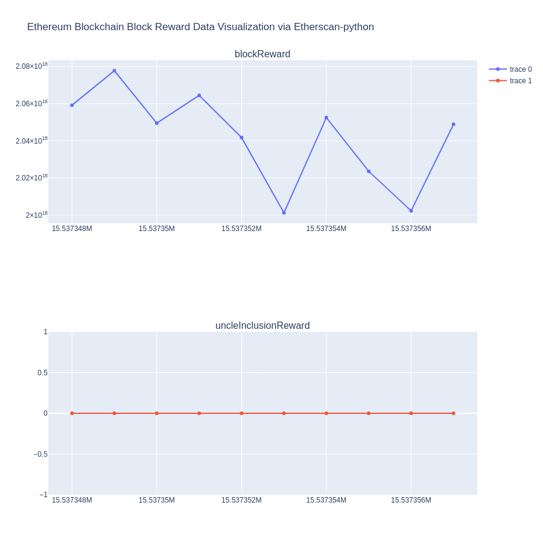

# Access Ethereum Blockchain Data: A Comparative Tutorial of Web3.py, Ethereum2-ETL, Etherscan-python, and Bigquery

This article provides a tutorial on how to access Ethereum blockchain data through four tools Web3.py, Ethereum2-ETL, Etherscan-python, and Bigquery.

## Part I `Web3py`

Web3.py is a Python library that allows interaction with Ethereum, typically used in decentralized apps. It offers functionality for sending transactions, working with smart contracts, retrieving block information and more. The library's API was initially based on Web3.js (Javascript), but has been adapted to better suit the needs of Python developers. 

- [Official documentation](https://web3py.readthedocs.io/en/stable/)
- [Sample Code](https://github.com/sunshineluyao/eth-data-collection/blob/main/code/web3py.ipynb)
- [Sample Data](https://github.com/sunshineluyao/eth-data-collection/blob/main/data/web3py_blocks.csv)
- [Read more](docs/web3py.md)

## Part II `ethereum2-etl`

Ethereum 2.0 ETL enables the transformation of blockchain information into user-friendly formats, such as CSV and relational databases. With over 700 likes on Github, Ethereum ETL is the most highly-regarded open source project for Ethereum data. Ethereum 2.0 ETL is a fork of Ethereum ETL that adds support for Ethereum 2.0 data. 

- [Official documentation](https://ethereum2-etl.readthedocs.io/en/latest/).

- [Read more](docs/ethereum2-etl.md)

## Part III `etherscan-python`

`etherscan-python` is a comprehensive Python API for [Etherscan.io](https://etherscan.io/). It offers both the standard and pro endpoints for the mainnet of Ethereum blockchain as well as that of the Kovan, Rinkeby, and Ropsten testnets. The API can be found on [PyPI](https://pypi.org/project/etherscan-python/) and is powered by the [Etherscan.io APIs](https://etherscan.io/apis#misc).

- [official documentation](https://github.com/pcko1/etherscan-python).
- [Sample Code](https://github.com/sunshineluyao/eth-data-collection/blob/main/code/etherscan_python.ipynb)
- [Sample Data](https://github.com/sunshineluyao/eth-data-collection/blob/main/data/etherscan_rewards.csv)
- [Read more](docs/etherscan-python.md)

## Part IV `bitquery`

Bitquery is a GraphQL API that provides a flexible and efficient way to access and analyze blockchain data. By using GraphQL, Bitquery enables users to query only the data they need, rather than receiving a large amount of unneeded data. This results in faster, more streamlined access to blockchain data, and improved performance overall. 

- [official documentation](https://bitquery.io/)
- [Detail](docs/bitquery.md)
- [Sample Code]()
- [Sample Data]()
